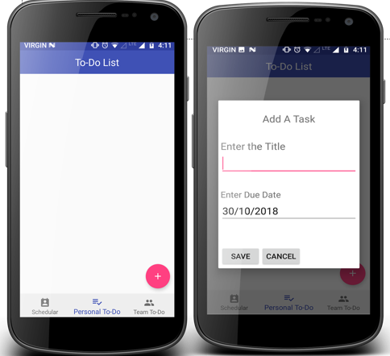
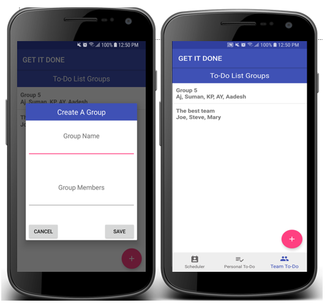
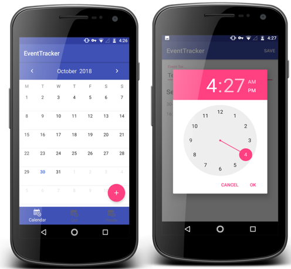
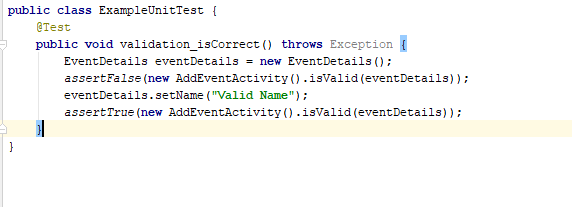
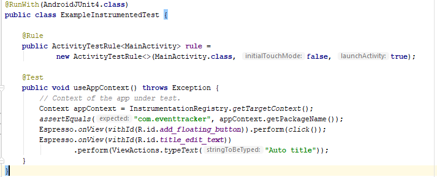

# GET IT DONE

| NAME   |      BANNER ID      |  EMAIL ID |    Contribution   |
|----------|:-------------:|------:|----------:|
|Aadesh Shah |  B00802629 | ad735938@dal.ca |  23.75%    |
| Aj Tarczy |    B00691379   |   ajtarczy@dal.ca |  5%    |
| Awotunde Ayodeji | B00766409 |    ay678865@dal.ca |  23.75%    |
| Kshitij Paithankar |    B00800573   |   ks258222@dal.ca |  23.75%    |
| Suman Singh | B00727915 |    sm644084@dal.ca |  23.75%    |

# Project Summary
The Proposed application brings TO-DO Lists, Calendars, and Group T-DO Lists into one app. On their personal TO-DO List, the user can create, add, edit, and delete tasks. If the user is a part of a group, they can also create a Group TO-DO List, and be able to have a shared TO-DO List for their group. The Calendar allows the user to schedule and manage events, so that they can better manage their non-immediate events. These parts of the application together serve the purpose of assisting in the organization of the users daily and longer-period tasks. This app would be especially useful to any individual person, business, or organization looking for a tool to help manage personal or group events. 

| TO-DO   | Group-ToDo  |  Event Schedular |
|----------|:-------------:|------:|
| |  |  |

### Repository
- https link: https://git.cs.dal.ca/tarczy/GetItDone
- ssh link: git@git.cs.dal.ca:tarczy/GetItDone.git
- The professor, along with all of the TA's listed on brightspace have been invited to our gitlab repo.Please note that we utilized the "Implement_the_calendar" branch as our master branch due to time constraints.

# Libraries
* Applandeo Calendar Library
* SwipeMenuListView

# Installation Notes
* Download the GETITDONE.ZIP File from GITLAB and import in Android Studio
* Android Studio will prompt you to upgrade gradle. Click on never update for this Project
* Build the app
* Run the app on an emulator or android device

# Code Examples
These are few coding and design issues we have faced and solved them.

##### Problem 1: Radio button issue
The application uses Activity for initializing all its major UI components; however, implementing the.To-List priority features using Fragment with radio button components posed a challenge.
We resolved this by implementing onCreateView on the fragment activity. Also, we created the onCheckedEventListener, to enable the application to detect the radio button clicked, then render the priority accordingly.

        RadioGroup radioGroup = (RadioGroup) tView .findViewById(R.id.radioGroup);
           radioGroup.setOnCheckedChangeListener(new RadioGroup.OnCheckedChangeListener()
                {
                    public void onCheckedChanged(RadioGroup group, int checkedId) {
                        // checkedId is the RadioButton selected

                        switch(checkedId) {
                            case R.id.radButton1:
                                Toast.makeText(getActivity(), "Radio 1", Toast.LENGTH_LONG ).show();
                                mPriority = 1;
                                break;
                            case R.id.radButton2:
                            Toast.makeText(getActivity(), "Radio 2", Toast.LENGTH_LONG ).show();
                                mPriority = 2;
                                break;
                            case R.id.radButton3:
                                mPriority = 3;
                                Toast.makeText(getActivity(), "Radio 3", Toast.LENGTH_LONG ).show();
                                break;
                        }
                    }
                });
#####  Problem 2: Create a task based on Priority
Most To-do list do not implement or assigned priority to their task. we tried to implement to improve usability on assigning priority to each task based on color code and it posed challenge for us.
We did a layer out that accepts three types of colors for the priorities and created a function that can detects the priority of the code and programmatically assigned a color to each task.

    private int getPriorityColor(int priority) {
        int priorityColor = 0;

        switch(priority) {
            case 1: priorityColor = ContextCompat.getColor(context, R.color.materialRed);
                break;
            case 2: priorityColor = ContextCompat.getColor(context, R.color.materialOrange);
                break;
            case 3: priorityColor = ContextCompat.getColor(context, R.color.materialYellow);
                break;
            default: break;
        }
        return priorityColor;
    }
 

##### Problem 3: Radio button issue Retreiving data from Firebase to Swipe ListView
We faced issue in fetching data from firebase database to Custom Listview.  The data was to be retrieved using Realtime database library of FIrebase which uses a class and constructor through which the data will be passed and added on to the list. The issue was solved by renaming the variables through which data was being retrieved.
The solution was to keep the name of the variables same as the child names in database.

    public TaskDetails() {
      }

    public TaskDetails(String TaskTitle, String TaskDueDate, String TaskPriority) {
        this.TaskTitle = TaskTitle;
        this.TaskDueDate = TaskDueDate;
        this.TaskPriority = TaskPriority;
    }
##### This function is a constructor of the class TaskDetails which gets the value from database and returns it to the list as shown below:

              public void onDataChange(DataSnapshot dataSnapshot) {
                // This method is called once with the initial value and again
                // whenever data at this location is updated.
                list.clear();
                for (DataSnapshot postSnapshot : dataSnapshot.getChildren()) {
                Log.d(TAG,"postSnapshot..."+postSnapshot );

                    try{
                        TaskDetails task = postSnapshot.getValue(TaskDetails.class);
                        Log.d(TAG,"Task is..."+task.getTaskTitle().toString() );
                        list.add(task.getTaskTitle().toString()+"\n\n"+task.getTaskPriority().toString()+"\n\n"+task.getTaskDueDate());
                    }
                    catch (Exception e){
                    Log.e(TAG, "Received an exception on data value change.. " + e.getMessage() );
                        e.printStackTrace();
                    }
                    
                    adapter.notifyDataSetChanged();
                }

            }

# Feature Section
Our Application GetItDone has three major components: To-Do List, Event Calendar, and Group To-Do Lists. We have three categories of functionality, minimum, expected and bonus functionality. 
* In the Calendar portion, users can click on days in the calendar to preform CRUD operations on events.
* In the To-Do portion, users can preform CRUD operations on tasks, as well as being able to set a priority for the tasks.
* In the Group To-Do portion, users can create 

# Final Project Status
We have completed 80% of the proposal and we could do below features if time permits.
1. Send push notifications for scheduler events beforehand.
2. Send push notifications to respective users when a to-do is assigned to them. 
3. Users can post photo comments on a to-do task.
4. Users can create teams and boards for to-do lists.
5. Camera feature to attach photos on events
6. Users can create teams and boards for to-do lists.
7. Users can assign to-do’s to people in their teams.
8. Users can add due dates to to-do tasks.
9. Users can login using Google credentials.

## Minimum Functionality 
#### TO-DO
Users can create a checklist of to-do tasks and save it.
1.  Basic UI for To-Do List (completed)
2.  Create, save, delete list.(completed)
  

#### Event Schedular
Users can create a Calendar event and save it.
1.	UI for Calendar Event including date, time selection.(completed)
2.	Create, save Event.(completed)

#### Group TO-DO
Users can create group To-DO list.
The features below are listed as partially completed due to being reliant on google authentication
which did not end up being implemented in time.
1. Users can create To-Do Teams.(partially completed)
2. To-Do Team leaders can add and remove users from groups. (partially completed)
3. Users can view their To-Do teams.(partially completed)

## Expected Functionality
#### TO-DO
Users can create a checklist of to-do tasks and save it.
  1.  Edit list/task.(completed)
  2.  Add priority to tasks.(completed)
  

#### Event Schedular
Users can create a Calendar event and save it.
1.	Delete, modify event.(completed)

#### Group TO-DO
Users can create group To-DO list.
1. Users can create To-Do Teams. (partially completed)
2. To-Do Team leaders can add and remove users from groups. (partially completed)
3. Users can view their To-Do teams. (partially completed)

## Bonus Functionality
#### Event Calendar-
1. Specify location using GPS for an event.(completed)

# Sources

## Application Design Document
- Please find the design guidelines and use cases for the implemented project [here](Docs/Software_Design_Document.pdf)

## Testing

- Junit Test Case Example

  
 
  
- Espresso test case example for UI

 

- Please fine manual Test cases done for each module [here](Docs/Manual_Test_Case.xlsx)

## Research Work
- https://github.com/Applandeo/Material-Calendar-View
- https://www.techradar.com/news/best-productivity-app
- https://www.entrepreneur.com/article/312312

## Tutorials used for programming, Testing, and Database
- https://developer.android.com/reference/android/widget/ListView
- https://developer.android.com/guide/
- https://www.tutorialspoint.com/android/
- https://www.tutorialspoint.com/firebase/
- https://www.tutorialspoint.com/junit/
- http://www.vogella.com/tutorials/JUnit/article.html

# References

1.	IEEE Standard 1016-1998, IEEE Recommended Practice for Software Requirements Specifications, IEEE Computer Society, 1998.
2.	Mokhov, S. (2010). Selected Project Requirements. In Concordia. Retrieved from http://users.encs.concordia.ca/~c55414/selected-project-requirements.txt
3.	En.wikipedia.org. (2018). Website wireframe. [online] Available at: https://en.wikipedia.org/wiki/Website_wireframe [Accessed 31 Oct. 2018]. 
4.	En.wikipedia.org. (2018). Scrum (software development). [online] Available at: https://en.wikipedia.org/wiki/Scrum_%28software_development%29 [Accessed 31 Oct. 2018].
5.	En.wikipedia.org. (2018). JUnit. [online] Available at: https://en.wikipedia.org/wiki/JUnit [Accessed 31 Oct. 2018].
6.	En.wikipedia.org. (2018). Espresso. [online] Available at: https://en.wikipedia.org/wiki/Espresso [Accessed 31 Oct. 2018].

